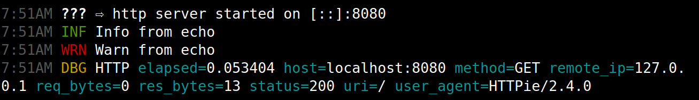

# Echo to Zerolog

[](https://pkg.go.dev/github.com/kofalt/echotozero)
[](https://goreportcard.com/report/github.com/kofalt/echotozero)
[](https://github.com/kofalt/echotozero/actions)

A simple adapter for using [Zerolog](https://github.com/rs/zerolog) with the [Echo](https://github.com/labstack/echo) web framework.



## Project status

**Complete.** Latest commit timestamp might be old - that's okay.

## Usage

Steal a complete example from [this file](demo/example.go) or try `go run ./demo` for a quick start.

```golang
import (
	"github.com/kofalt/echotozero"
	"github.com/labstack/echo/v4"
	"github.com/rs/zerolog"
)

func main() {
	// Web framework
	e := echo.New()
	e.HideBanner = true

	// Create or use any zerolog logger
	zl := zerolog.New()
	adapter := echotozero.New(zl)

	// Log echo messages + http queries
	e.Logger = adapter
	e.Use(echotozero.Middleware(adapter))
}
```

You can also steal `middleware.go` and mess with which request details are logged.

## Notes

This repo is an updated fork of [Lecho](https://github.com/ziflex/lecho) with a few improvements:

* Simplifed surface area
* Easier to read middleware
* Removed context fiddling
* Added a log level to echo's messages when it lacks one
* Punt more features directly to zerolog
* Updated for more recent golang, actions, etc

There's also a large golang [logging discussion](https://github.com/golang/go/discussions/54763) going on that might influence both libraries in the future.<br/>
This will hold the two together for now.

## Known issue

The very first message echo prints is without a level:

```
7:51AM ??? ⇨ http server started on [::]:8080
```

Zerolog supports this just fine, but it would be nice to have everything leveled. This message happens because the echo interface demands `Output() io.Writer` and, for some reason, uses that to print its startup message. Could probably be fixed by messing with echo.
